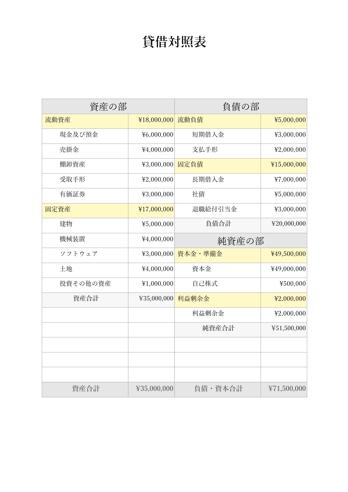
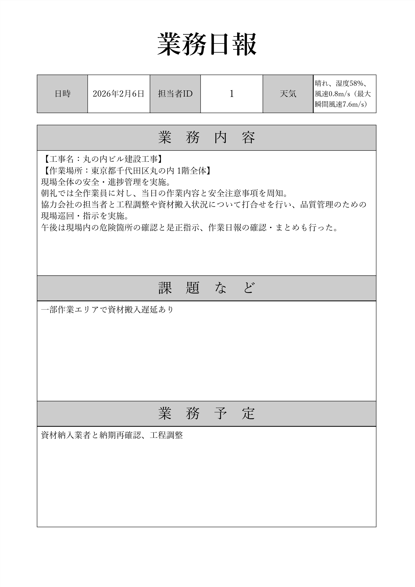
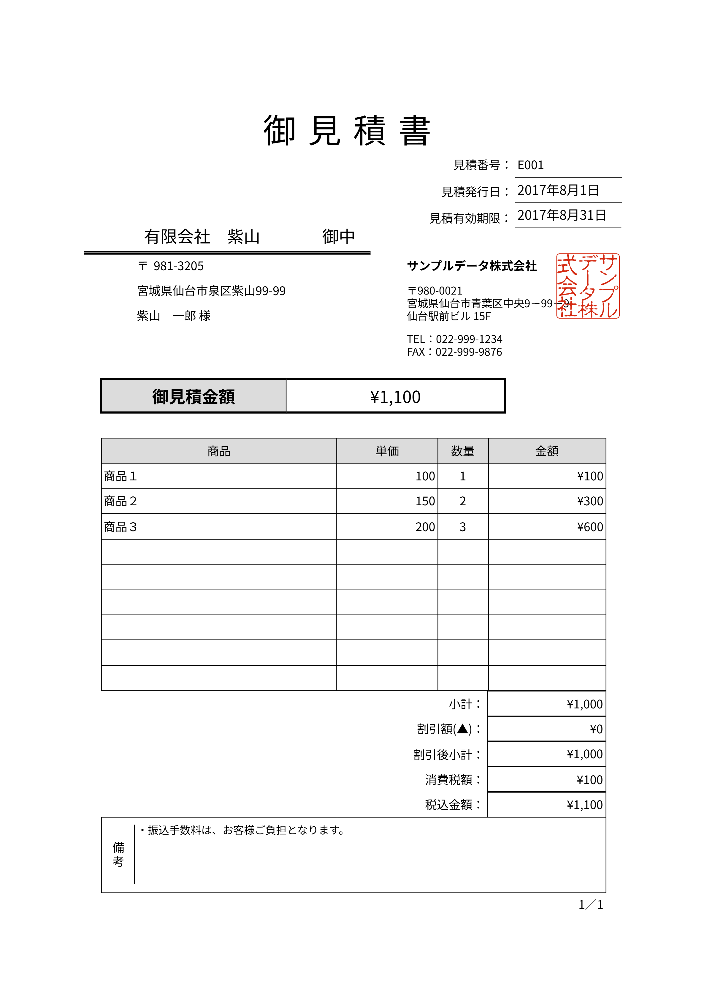
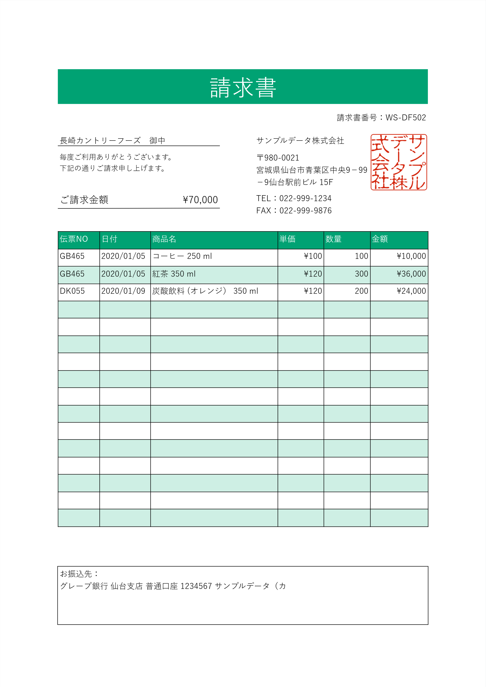
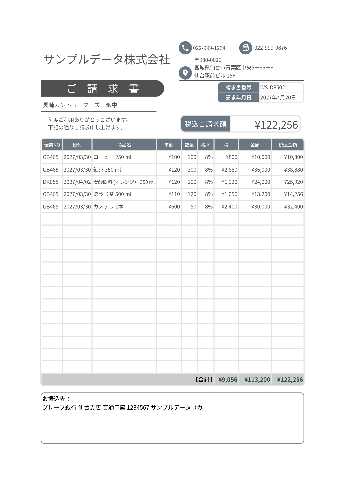
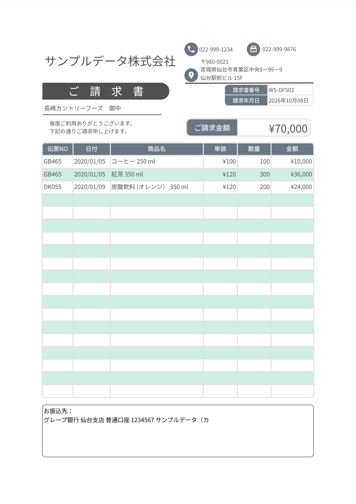
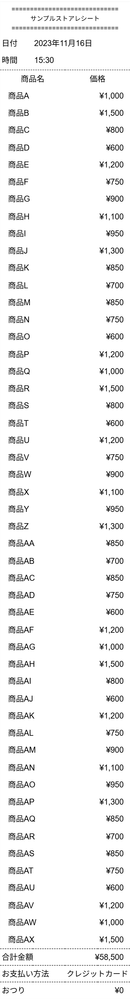
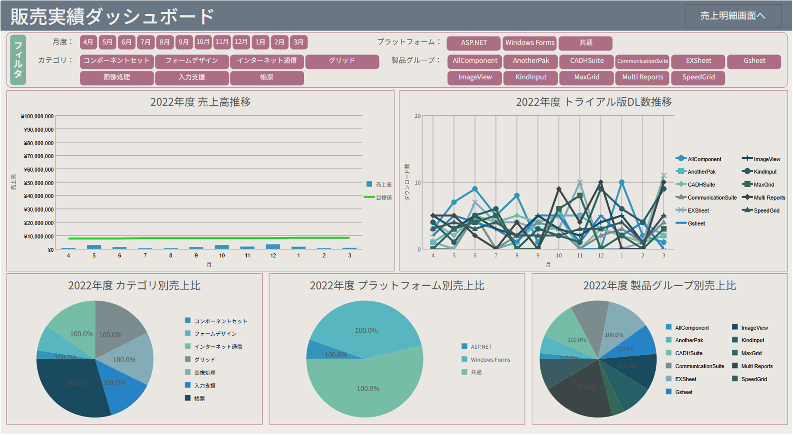

# ActiveReportsJS レポートサンプル

ActiveReportsJS のレポートビューアーで、サンプルレポートをプレビューするプロジェクトです。レポートファイルを選択すると、ブラウザー上で帳票を表示できます。

## レポート一覧

| レポート | 内容 |
| --- | --- |
| [貸借対照表](Reports/balance-seet.rdlx-json) | 資産・負債・純資産の内訳と合計をまとめた帳票 |
| [業務日報](Reports/daily_reports.rdlx-json) | 日時、担当者、天気、業務内容、課題、今後の予定を記録する帳票 |
| [見積書](Reports/Estimate.rdlx-json) | 宛先、見積金額、明細、税額を記載した帳票 |
| [請求書（基本）](Reports/Invoice-1.rdlx-json) | 請求先、請求金額、商品明細を記載した帳票 |
| [請求書（税額明細付き）](Reports/Invoice-2-WithTaxDetails.rdlx-json) | 税率、税額、税込金額の明細を含む請求書 |
| [請求書（合計表示）](Reports/Invoice-2.rdlx-json) | 請求金額と商品明細をまとめた請求書 |
| [レシート](Reports/receipt.rdlx-json) | 商品、価格、合計金額、支払い方法を記載したレシート |
| [販売実績ダッシュボード](Reports/SalesDashboard.rdlx-json) | 売上推移やカテゴリ・プラットフォーム別の実績を可視化するダッシュボード |

## レポートプレビュー

各画像はレポートのプレビューです。レシートはゲラモードで表示しています。

<details>
<summary>貸借対照表</summary>


</details>

<details>
<summary>業務日報</summary>


</details>

<details>
<summary>見積書</summary>


</details>

<details>
<summary>請求書（基本）</summary>


</details>

<details>
<summary>請求書（税額明細付き）</summary>


</details>

<details>
<summary>請求書（合計表示）</summary>


</details>

<details>
<summary>レシート（ゲラモード）</summary>


</details>

<details>
<summary>販売実績ダッシュボード（ページ全体）</summary>


</details>

## 起動方法

1. このリポジトリを取得します。
2. リポジトリのルートをローカルの Web サーバーで配信します。たとえば、Visual Studio Code の Live Server 拡張機能を利用できます。
3. ブラウザーで `index.html` を開きます。

ActiveReportsJS のライブラリとフォントは CDN から読み込まれるため、プレビューにはインターネット接続が必要です。

## ライセンスキーの設定

配布ライセンスキーを使う場合は、`license.example.js` を `license.js` にコピーし、`window.ARJS_DISTRIBUTION_KEY` にキーを設定してください。`license.js` は `.gitignore` で除外されているため、キーがリポジトリに追加されないようになっています。キーを設定しない場合、評価版の透かしが表示されることがあります。

## ディレクトリ構成

```text
.
├── Reports/       # ActiveReportsJS のレポート定義
├── assets/        # README 用のレポートプレビュー画像
├── index.html     # レポートビューアー
├── license.example.js
└── Readme.md
```
